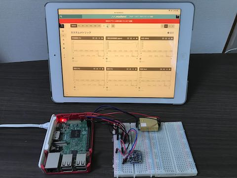

# MONITOR_ROOM

Measure environmental values and record them on the monitoring server 

## DEMO



## Requirement

- Python 3
- Raspberry Pi 3
- Sensors
    - BME280 (humidity, pressure, temperature)
    - MH-Z19 (co2)
    - TSL2561 (light)

## Usage

- Run from cron
    ```
    // run every second
    $ * * * * * for i in `seq 0 1 59`;do (sleep ${i}; python monitor_room/main.py) & done;
    ```

## Instration

1. Git clone
    ```
    $ git clone xxx
    ```

1. Set environment variable
    ```
    $ export MONITOR_ROOM_MACKEREL_X_API_KEY="YOUR_MACKEREL_X_API_KEY"
    $ export MONITOR_ROOM_MACKEREL_HOST_ID="YOUR_MACKEREL_HOST_ID"
    ```

1. Make mackerel account

## Before commit

1. Exec lint
    ```
    $ flake8 main.py ./maintenance/ ./sensor/ ./util/
    $ pylint main.py ./maintenance/ ./sensor/ ./util/
    ```

## Author

[kazumatsudo](https://kazumatsudo.jp)

## License

[MIT](./LICENSE)